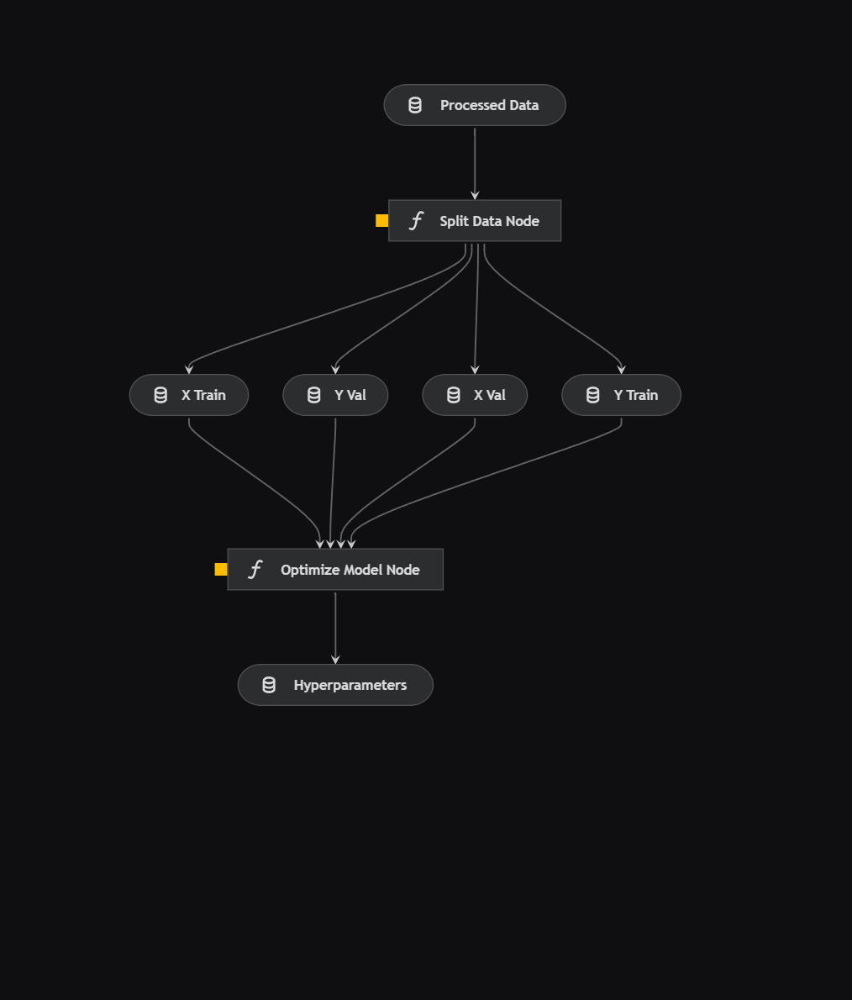
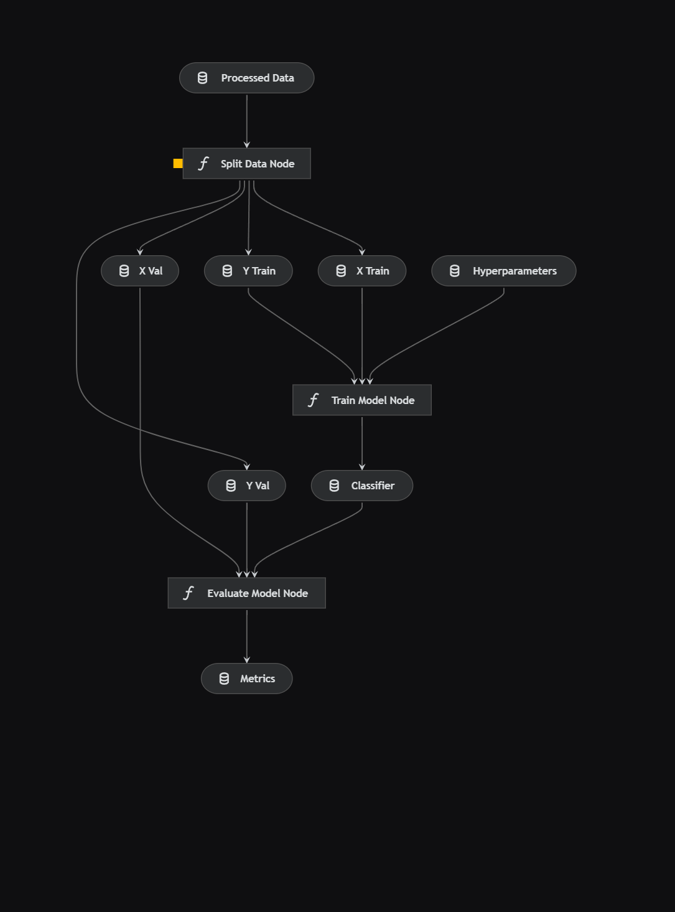
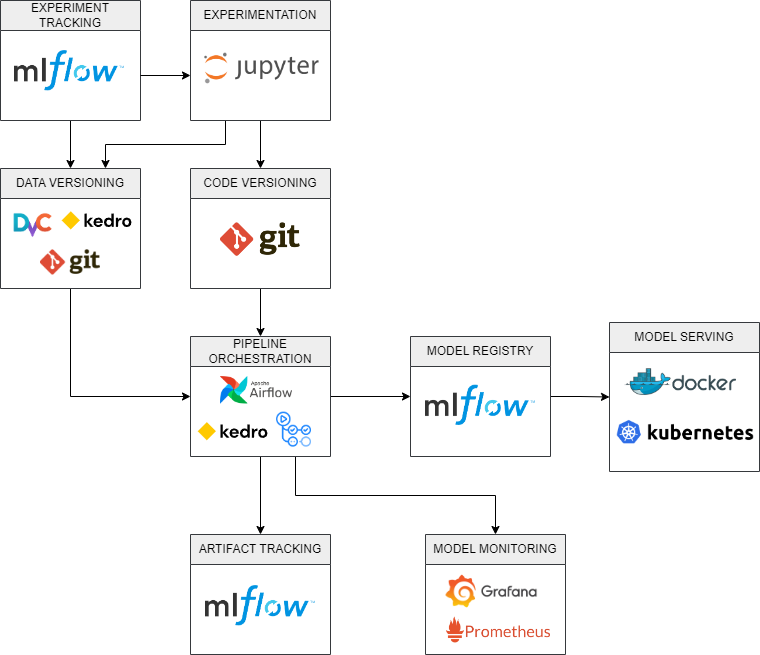

# Case Stone

## Visão Geral

Este projeto faz parte de um case realizado para preenchimento de uma vaga de Data Science da Stone. O foco é conseguir realizar a previsão da TPV de adquirência com a base de dados disponibilizada.

A estrutura deste repositório é a seguinte:

- conf: Inclui as configurações básicas do projeto (arquivos YML) e ambientes (base e local). Aqui ficam o catálogo de todos os dados e parâmetros que serão utilizados nos pipelines.
- data: Armazena os dados utilizados no projeto ao longo de todas as etapas. Métricas, modelos e hiperparâmetros também são guardados aqui. Os dados brutos devem ficar em data/01_raw
- notebooks: onde os notebooks com testes e rascunhos são armazenados
- src: local onde são armazenados e organizados os pipelines do Kedro:
    * Cada pipeline possui um conjunto de nodes e pipelines. Neste projeto em particular criamos os seguintes:
        - data_processing
        - model_tuning
        - model_training
    * Com o comando
    <code>kedro run --pipeline nome_do_pipeline</code> podemos usar cada pipeline separadamente.

## Exploração e Teste

Nesta etapa utilizamos os notebooks para realizarmos a [exploração dos dados](https://nbviewer.org/github/diogolbar/tpv-prediction/blob/master/notebooks/01-EDA.ipynb) e em seguida iniciamos testes de [modelagem](https://nbviewer.org/github/diogolbar/tpv-prediction/blob/master/notebooks/02-Model_Training.ipynb).

## Criação de Pipelines

Com os rascunhos feitos nos notebooks, podemos partir para a criação dos pipelines :

- data_processing: este pipeline realiza os mesmos passos que foram realizados no processo de testes. Sua entrada são os dados brutos e a saída são os dados já devidamente processados em data/03_primary/

- model_tuning: utiliza uma otimização bayesiana baseada em extra trees para otimizar os hiperparâmetros do modelo. Sua entra são os dados processados e a saida é uma lista (pickle) em data/05_model_input/

    

- model_training: treina um modelo com os hiperparâmetros da etapa anterior e salva um modelo. Sua entrada são os dados processados, os hiperparâmetros da etapa de tuning e a saída é um modelo em data/06_models/
    
## Melhorias no Modelo

O escopo do projeto foi modificado para um classificador para multiclasses, que permite que consigamos predizer intervalos de valor da TPV ao invés de um valor contínuo com um pouco mais de segurança.

Com base nisso, uma melhoria futura seria a criação de um ou mais modelo de regressão que será alimentado com as variáveis previstas pelo classificador.

Caso estes novos modelos sejam de fato utilizados, devem ser treinados e retreinados individualmente.

## Planejamento para Stack simples de MLOps

1. Ajustes:
    * Versionamento: o versionamento dos dados precisa ser revisto a depdender do tamanho da base que será utilizada. Neste projeto o versionamento foi realizado no próprio **Git** combinado com as funcionalidades do **Kedro** pois a base utilizada é pequena, para casos em que a base for maiorferramentas como **DVC** podem ser utilizadas.
    * Tracking: O tracking geral de experimentos, artefatos e modelos pode ser realizado com o **MLFlow**
    * Orquestração: 
        * Pipelines de dados: para pipelins mais complexos poderiamos utilizar o **Airflow** ou alguma ferramenta equivalente
        * CI/CD: Também pode ser realizada via **Github Actions** combinando com as facilidades do **Kedro**
1. Implantação em Produção:
    * Criaçãod de uma API para receber requisições:  
    * Utilização de **Docker** para containerizar os modelos
    * Utilização de **Kubernetes** em um serviço de nuvem como **Google Kubernetes Engine** para realizar o deploy do container
2. Monitoramento dos Modelos:
    * Para monitoramento dos modelos podemos utilizar ferramentas como:
        * **Prometheus**: Para monitoramento e alertas (pode ser combinado com o Grafana)
        * **Grafana**: Criação de Dashboards personalizados para monitoramento das métricas
        * **Metabase** ou **Superset**: caso algum desses produtos já seja utilizado, é possível personalizarmos dashboards neles para que possamos acompanhar as métricas desejadas dos nossos modelos.

 
