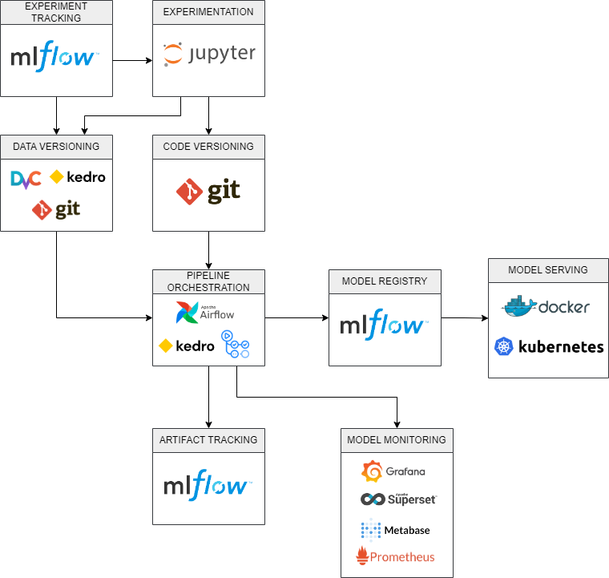

# Case Stone

## 1. Visão Geral

Este projeto faz parte de um case realizado para o processo seletivo de Data Science da Stone. O foco é conseguir realizar a [previsão do TPV](https://github.com/diogolbar/tpv-prediction/blob/master/test.ipynb) de adquirência com a base de dados disponibilizada.

A estrutura deste repositório é a padrão do [Kedro](https://kedro.org/) e tem o seguinte conteúdo:

- conf: Inclui as configurações básicas do projeto (arquivos YML) e ambientes (base e local). Aqui ficam o catálogo de todos os dados e parâmetros que serão utilizados nos pipelines.
- data: Armazena os dados utilizados no projeto ao longo de todas as etapas. Métricas, modelos e hiperparâmetros também são guardados aqui. O CSV com os dados brutos deve ficar em data/01_raw, mas não está disponíveis neste repositíro
- notebooks: onde os notebooks com testes e rascunhos são armazenados
- src: local onde são armazenados e organizados os pipelines do Kedro:
    * Cada pipeline possui um conjunto de **nodes** (funções) e **pipelines**. Neste projeto em particular criamos:
        - **data_processing**
        - **model_tuning**
        - **model_training**

Extra:
- .github: este diretório armazena dois workflows funcionais do [Github Actions](https://docs.github.com/pt/actions).

## 2. Exploração e Teste

Nesta etapa utilizamos dois notebooks para realizarmos a [exploração dos dados](https://nbviewer.org/github/diogolbar/tpv-prediction/blob/master/notebooks/01-EDA.ipynb) e em seguida realizamos testes de [modelagem](https://nbviewer.org/github/diogolbar/tpv-prediction/blob/master/notebooks/02-Model_Training.ipynb) para criação de nosso modelo preditivo.

## 3. Criação de Pipelines

Com os rascunhos feitos nos notebooks, criamos os seguintes pipelines:

- **data_processing**: este pipeline realiza os mesmos passos que foram realizados no processo de testes. Sua entrada são os dados brutos e a saída são os dados já devidamente processados em data/03_primary/

- **model_tuning**: utiliza uma otimização bayesiana baseada em extra trees para otimizar os hiperparâmetros do modelo. Sua entrada são os dados processados e a saida é uma lista em data/05_model_input/

  

- **model_training**: treina um modelo com os hiperparâmetros da etapa anterior, salva o modelo e em seguida o avalia e salva as métricas de avaliação. Sua entrada são os dados processados, os hiperparâmetros da etapa de tuning e a saída é um modelo em data/06_models/ e as métricas resultantes em data/09_tracking

  

## 4. Implantação
Ainda não foi criada nenhuma API para o modelo, mas foram criados e agendados dois workflows no Github Actions para retreino e nova otimização do modelo:
    
- **Train Model** - roda todo domingo as 00:00: treina o modelo utilizado o pipeline **model_training**
- **Optimize Model** - roda todo dia 1 do mês as 00:00: gera novos hiperparâmetros para serem utilizados pelo modelo que será treinado.

Ambos podem ser facilmente modificados e novos workflows podem ser colocados para rodar no github actions (estando dentro dos limites da tier gratuita)

## 5. Melhorias no Modelo

O escopo do projeto foi modificado para um classificador para multiclasses, que permite que consigamos predizer intervalos de valor da TPV ao invés de um valor contínuo com um pouco mais de segurança.

Com base nisso, uma melhoria futura seria a criação de um ou mais modelo de regressão que será alimentado com as variáveis previstas pelo classificador e gerará previsões que respeitem os intervalos de valor do TPV definidos no momento em que treinamos o classificador.

Caso estes novos modelos sejam de fato utilizados, poderão ser treinados e retreinados individualmente ou em conjunto.

## 6. Esboço de uma Stack simples de MLOps

1. **Ajustes**:
    * **Versionamento**: o versionamento dos dados precisa ser revisto a depdender do tamanho da base que será utilizada. Neste projeto o versionamento foi realizado no próprio **Git** combinado com as funcionalidades do **Kedro** pois a base utilizada é pequena, para casos em que a base for maior ferramentas como **DVC** ou algo mais escalável pode ser utilizadas.
    * **Tracking**: O tracking geral de experimentos, artefatos e modelos pode ser realizado com o **MLFlow** em combinação com **Kedro**. 
    * **Orquestração**: 
        * **Pipelines de dados**: para pipelins mais complexos poderiamos utilizar o **Airflow** ou alguma ferramenta equivalente
        * **CI/CD**: pode ser realizada via [**Github Actions**](https://github.com/diogolbar/tpv-prediction/actions) combinando com as facilidades do **Kedro**

1. **Implantação em Produção:**
    * Criação de uma **API** para receber requisições:  
    * Utilização de **Docker** para containerizar os modelos
    * Utilização de **Kubernetes** em um serviço de nuvem como **Google Kubernetes Engine** para realizar o deploy do container
2. **Monitoramento dos Modelos:**
    * Para monitoramento dos modelos podemos utilizar ferramentas como:
        * **Prometheus**: Para monitoramento e alertas (pode ser combinado com o Grafana)
        * **Grafana**: Criação de Dashboards personalizados para monitoramento das métricas
        * **Metabase** ou **Superset**: caso algum desses produtos já seja utilizado, é possível personalizarmos dashboards neles para que possamos acompanhar as métricas desejadas dos nossos modelos.

 
